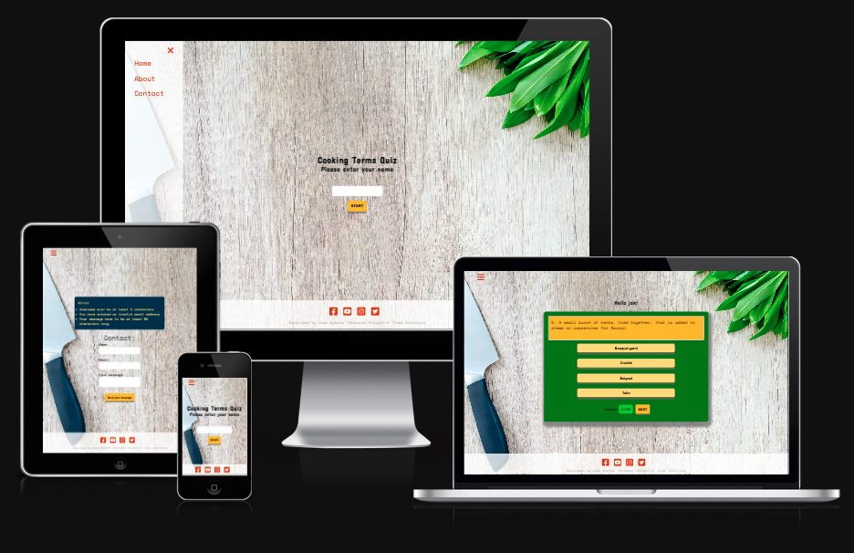
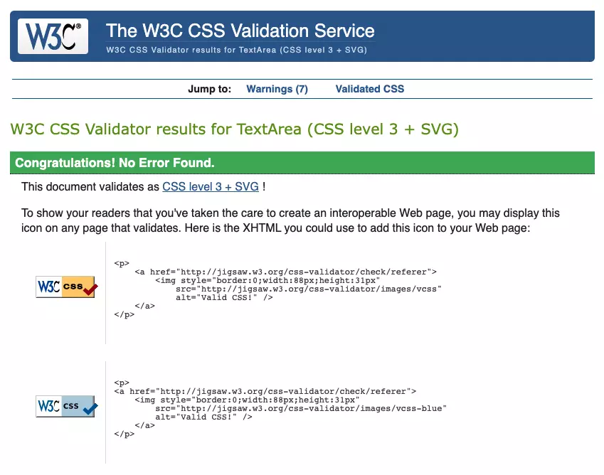
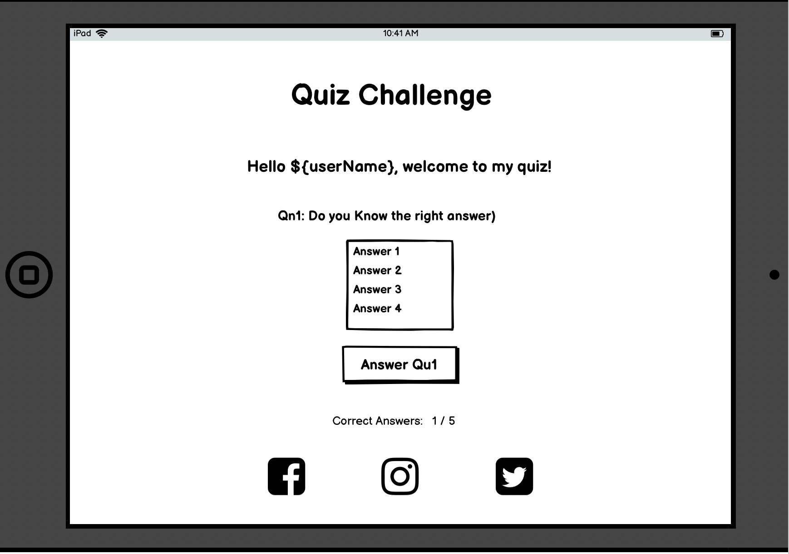
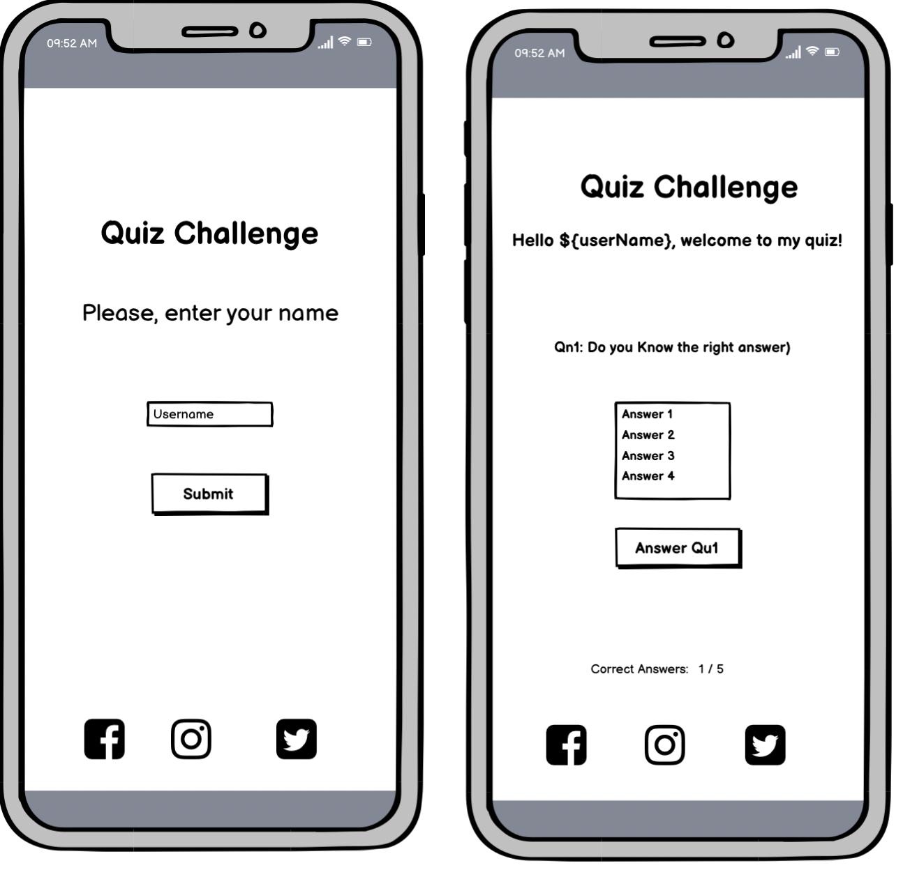

# Quiz App - Javascript (PP-2)

[Live website here](https://josemguerra.github.io/quiz-app/)

## Description

This Website is the 2st out of five Personal Projects for the Code Institute's  Web Developer course
with e-Commerce applications. It is built using HTML5, CSS and vanilla JAVASCRIPT
The last update to this file was: **JuLY 24, 2022**

This project is an educational online quiz that will help the user to sharpen or even learn new professional cookery terminology.

## Target user

### The target user for the website is

- English speaker.
- Interested in a quizzes and/or cooking.

### User of this website are browsing for

- An interactive online quiz.

- Acquiring new knowledge.

## User stories

### As a first time user

- I want to navigate the site easily.
- I want to find the content I am looking for.
- I want to be challenged.
- I want it to be interactive.
- I want to get feedback when I answer a question correctly or incorrectly.
- I want to keep track of my score.
- I want to be able to view the content in my mobile phone.

### As a returning user

- I want to see a feature if I answer all question correctly.
- I want to be able to contact through social media.
- I want to be able to fill a contact form to ask questions or make suggestions.

## Structure

### Typography

Main font used in the App is Space Mono which has excellent readability features and compliments the
Concert One Cursive font of the headings.

### Layout

The website is two pages with a fully responsive layout.

### Landing page

The user will land to a page with a full screen image of a wooden table on top of which the is a
chef knife on the bottom left corner and a bunch of cooking herbs on the top right corner of the screen,
there is also a main heading with the title 'cooking quiz' making it clear to the user  of what the website
is about. Bellow the heading there is a username input that the user is required to fill in order to gain access
to the quiz. Once filled in and submitted, this data is used to personalized  welcome message for the user.In the
bottom of the page the user will find links to the most popular social networks.

### Animated navigation menu

The site has an overlay side menu, activated my clicking on a hamburger icon situated at the top left of game and contact page.
The menu has a exit link that will take the user to the landing page,
an About link that when clicked pop up a modal with information about the quiz.
A contact link that will take the user to a fully validated contact form page.
It also counts with timeout functionality for a better user experience in the menu and about section..

### Quiz section

This is the main section of the website. The quiz section  will feature a card with a question on the top and four
possible answers encapsulated in the form of a button. When the user press a button with the selected answer will get
immediate feedback. The background will turn green if the answer is correct and red is the answer is incorrect.
The score will also be updated showing the user newly achieved score and the total amount of question.
The button next will appear so the user can move onto the next question and so on.

### Features

- Scoring system.
- Input validation for username.
- Randomize order of questions when user plays again.
- A modal message will pop congratulating the user if he/she achieve  the maximum score.
- A three input fields contact form with validation and feedback of the data required.

### Features left to implement

- Larger data base of questions.

## Technologies

- [HTML](https://www.w3schools.com/html/default.asp)
  - This project uses html as the mark up language to give structure to the website.
- [CSS](https://www.w3schools.com/css/default.asp)
  - This project uses css language to style the website.
- [JAVASCRIPT](https://www.w3schools.com/js/default.asp)
  - This project uses javascript language add interactivity the website.
- [Github](https://github.com/)
  - GitHub is the site used to store the source code for the Website.
- [Git](https://git-scm.com/)
  - Git is the  version control software used to commit and push code to the GitHub repository where the source code is stored.
- [Visual Studio Code](https://code.visualstudio.com/)
  - VS Code for short is the integrated development environment (IDE) software used to build the website.
- [Developer Tools](https://developer.chrome.com/docs/devtools/)
  - Google chromes built in developer tools are used to inspect page elements and help debug issues with the site layout and test different CSS styles.
- [Balsamiq](https://balsamiq.com/givingback/free/classroom/)
  - This software was used to create wireframes or sketches of the website.
- [Google Fonts](https://fonts.google.com/)
  - Google fonts are imported and used as main typography in the project.
- [Font Awesome](https://fontawesome.com/)
  - Icons from fontawesome are used for throughout the website, from navigation to social media links in the footer.
- [TinyPNG](https://tinypng.com/)
  - Is the software used to reduce the weight of the images making the website faster and save bandwidth.

- [Simple Images Converter](https://www.simpleimageresizer.com/online-image-converter)
  - Is a image format converter Application to optimize images.

- [Code Beautify](https://codebeautify.org/)

  - Is a software that help beautify the code resulting in reducing data an improving performance.

## Testing

- ### Event Listeners

  - All event listeners  have been tested and they are working as they are expected.
    - start button
    - Enter key
    - answer buttons
    - next button
    - try again button

- ### Username input

  - Input field in the form are working as expected, eg. if user misses to fill the required
    field a change in font color will catch user attention to fill the the username input.

- ### Contact form

  - Name, email and textarea inputs have been tested and are working as expected. Validating that user inputs are correct.
  - If it is filled correctly will be redirected to a page with a message indicating the form has been sent successfully.

- ### HTML and CSS

  - HTML validation

    - 

  - Readable colour scheme checker

    - Welcome page.

    - 

    - Quiz section.

      - 

    - Wrong answers contrast

      - 

  - CSS validation

    - 

  - JSHINT validation

    -   

  - Lighthouse Test

    - 

  - Compatibility test

    - The website had been tested on Windows-10, Mac Os, Android phone, Safari, Google Chrome with no errors reported.

### Bugs report

- User can skip question without answering them.
  - solution: hide next button between questions.

- Lighthouse test reported missing labels in input fields.
  - solution: added labels to input tags.

- Lighthouse performance test on mobile does not passed.
  - I lightened the size of images but still does not pass.

- I detected that random questions were repeating some of the questions unless page was reloaded , so i had to redesign the site, and so the quiz is in it's own html file.

## Wireframe

- It has been some changes from the initial sketch to improve the visual design.

  - 
  - 
  - 

## Deployment

- The site was deployed to GitHub pages. Following this steps:

  - Log in to GitHub and access the Repository.
  - In the GitHub repository, navigate to the "Settings" tab.
  - Go to  "Pages" on the left hand menu.
  - Under "Source", select "Main" in the dropdown menu.
  - Next to select "Root" in the right drop drown menu.
  - Click the "Save" button.
  - Your site URL will be highlighted in green and ready un a few minutes.

## Resources / Credits / Inspiration

- The theme of the project is inspired on my background.
- Background images are from unsplash (linked bellow).
- [W3Schools documentation](https://www.w3schools.com/)
- [Unsplash](https://unsplash.com/photos/f-TWhXOrLiU)
- [WebDev-Simplified-course](<https://courses.webdevsimplified.com/>
  - Modal is from one of the exercises I did during the course.
- Love Math project.

## Acknowledgments

- Thank you to my mentor Brian Macharia for guiding me and for his invaluable advice, to Senior Software
Engineer and friend Eduardo Gonzalez for helping me in a moment when I got stuck, and  to the slack community of Code Institute, they are just great.
